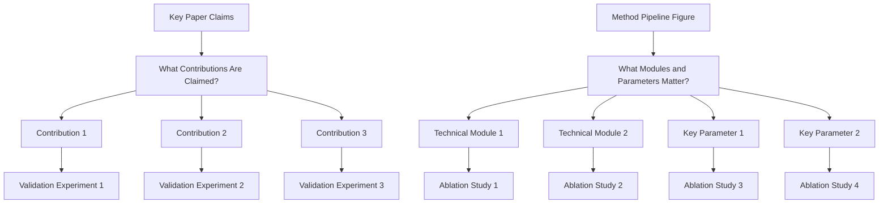
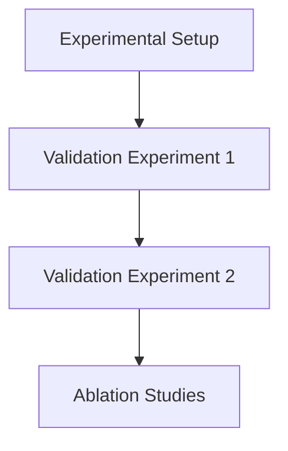

# Experiments Writing Guide

## Goal

Convince reviewers with complete evidence on effectiveness, causality, and practical value.

## Scope: Write-Up vs. Design

This file covers **writing up** experiments: section structure, tables, figures,
captions, and the rigor checklist for a results section.

Decide **what to run and why** first, using `references/experiment-design.md`
(claim-first design, comparison roles, matched budgets, primary-outcome choice, and the
protocol for writing experiments before results exist). Do not start drafting an
Experiments section without having settled the claim each experiment tests.

## Three Core Questions

1. Is the method better than strong baselines?
   - Run comparison experiments against strong and recent baselines.
   - Report standard metrics on the main benchmark(s).
   - Include SOTA or strongest public methods, not only weak baselines.
   - Keep protocol fair (same data split, preprocessing, and evaluation settings).
2. Which modules/design choices make the gain?
   - Run ablation studies for each key module/design choice.
   - Use remove/replace/disable variants and report delta to full model.
   - Include component interaction ablations when modules are coupled.
3. How far can the method generalize under harder settings?
   - Run demos/evaluations on harder or out-of-distribution settings.
   - Add stress-test scenarios (more complex scenes, rarer cases, noisier inputs, or stricter constraints).
   - Report both gains and failure modes to show realistic boundaries.

## Keep Comparison Roles Distinct in the Write-Up

Questions 1 and 2 above answer different things, and the section must not blur them.
External comparisons establish that the complete method is competitive; ablations explain
which internal choice causes the benefit. Removing a component from your own method never
substitutes for a comparison against someone else's method.

When you present them together, label which role each table serves, so a reviewer does
not read an ablation as a competitiveness claim. See
`references/experiment-design.md` for the full treatment.

## Scope the Main Narrative to the Contribution's Class

When the method improves a class of approaches, make that class the comparison subject in
the main performance narrative. Prefer "the strongest baseline" or, when justified, "the
best SOTA baseline" to a succession of named-method comparisons — this keeps the emphasis
on the general contribution rather than presenting an incremental modification to one method.

Names still belong in baseline setup, tables, legends, citations, and comparisons where
identity explains the result: an ablation, objective change, equal-budget control, or
backend substitution. Do not replace a specific experimental control with "SOTA" if that
changes which comparator or budget the claim refers to. "Best" means the best eligible
comparator for the stated model, metric, and protocol; it is not evidence of superiority
to all published work. Use an asserted SOTA designation only with support.

## Write Short Result-Led Paragraphs

A useful progression within each result paragraph:

1. State the comparison or the question, briefly including the defining control.
2. Refer to the figure/table and give its principal observation.
3. Give one representative gain with its model, metric, and comparator.
4. Explain what feature of the method accounts for the observation, at the strength the evidence supports.

These roles need not occupy four sentences. For a main comparison, one sentence can
introduce the figure and overall result. For an ablation, the first sentence should
explain what is varied and held fixed. End with a concrete mechanism or consequence, not
another sentence saying the experiment validates the method.

Avoid stacked numerical pairs and repeated "respectively" clauses — let tables carry the
full matrix. Do not recap the training algorithm in Setup or insert irrelevant architecture
taxonomies. Prefer:

- Focused: "On model M at 2bit, A improves LCB accuracy by 0.97% over the strongest evaluated baseline."
- Over: "A gains 3.45 and 3.32 points over B, and 0.97 and 0.72 points over C, respectively."

The focused form still needs a traceable comparator; omitting names from prose does not
discard attribution.

## Report Evidence Status Honestly

1. **Separate completed evidence from proposed experiments.** Never let planned work read
   as measured work.
2. **Mark unmeasured cells** as `TBD` or an equivalent label; leave them empty rather than
   filling them with zeros or plausible values.
3. **Retain ties, losses, failures, and adverse regimes.** A table where the method wins
   every cell invites suspicion; an honest loss with an explanation builds credibility.
4. **Distinguish author-reported from reproduced numbers.** Mark which results you copied
   from a paper and which you ran yourself, and state the reproduction protocol.
5. **State magnitudes with correct units** — percentage points vs. relative percent, time
   reduction vs. speedup. See `references/experiment-design.md` and
   `references/human-voice.md` (§2).

### Author notation conventions

The default is to write an absolute accuracy gap as "percentage points." If the author's
manuscript convention instead writes it as `0.97\%`, preserve that form — but preserve the
subtraction on the 0–100 scale, and **do not divide by baseline accuracy or call it a
relative improvement**. Clarify the convention once in an appendix or metric note.

Runtime and memory percentage reductions remain relative ratios; speedup is a separate
quantity. Loss differences and correlations retain their own units. Keep unmeasured values
and dependent interpretations in the agreed `TBD` / `\tofill{}` notation with source
provenance. Do not turn assumed noise into a measured Std or infer efficacy from a
prescribed ranking. Preserve negative outcomes and numerical limits even while making the
writing concise.

## Experiment Planning

## Experiment Section Decomposition

## Figure/Table Writing Rules

`Good tables are part of experiment communication quality, not decoration.`

1. Figure captions and table captions are equally important in the writing quality of Experiments.

### Hard rules

1. Put caption above the table.
2. Avoid vertical lines (`|`) in tabular columns.
3. Do not use double rules or dense `\hline` stacks.
4. Use `booktabs` style (`\toprule`, `\midrule`, `\bottomrule`) for clean structure.
5. Use as few horizontal rules as possible; lines should separate groups, not every row.
6. Highlight key numbers (best/second-best or target rows) with subtle color emphasis.

### Readability rules from review practice

1. Label metric direction in column headers (for example `PSNR ↑`, `LPIPS ↓`).
2. Add units when needed so values are interpretable without guessing.
3. Align text columns left; keep numeric columns consistently aligned.
4. Keep numeric precision consistent (same decimal places within a metric column).
5. Group multi-dataset or multi-setting results using `\multicolumn` + `\cmidrule`, not vertical separators.
6. One table, one message: do not mix unrelated results in a single table.
7. If rows represent different attributes/ablations, encode that explicitly in row names or attribute columns.
8. Keep caption focused on setting/protocol/notation, not long discussion.
9. If there is little detail to explain, use one concise sentence to summarize the main result.
10. For single-column figures/tables in two-column papers, prefer placing them in the right column when layout allows, so readers can enter the page from the left-top text without breaking reading flow.

### Minimal LaTeX checklist

1. Add packages in preamble: `\usepackage{booktabs}`, `\usepackage{colortbl,xcolor}` (and optionally `\usepackage{siunitx}` for decimal alignment).
2. Replace `\hline`-heavy style with `\toprule/\midrule/\bottomrule`.
3. Put `\caption{...}` before `\label{...}` and keep caption above.
4. Use restrained highlighting; never color too many cells.

## Recommended Ablation Package

1. One core ablation table for all major contributions.
2. Several focused mini-ablations for module-level design choices.
3. Matching qualitative visual results for each important ablation.

## Experimental Rigor Checklist

1. Are baselines recent and relevant?
2. Are metrics sufficient and standard for this task?
3. Is ablation tied to every key design claim?
4. Are claims in Abstract/Introduction supported by reported numbers?
5. Are limitations of evaluation scope explicitly stated?
6. Is there at least one external comparison against a strong same-capability alternative,
   distinct from the ablations?
7. Were baselines given comparable tuning, information, and compute, with the accounting
   stated?
8. Are comparisons with different assumptions or budgets reported separately rather than
   merged into one ranking?
9. Are magnitudes reported with the correct unit and denominator (percentage points vs.
   relative percent, reduction vs. speedup)?
10. Are unmeasured results marked `TBD` rather than filled in, and are author-reported
    numbers distinguished from reproduced ones?
